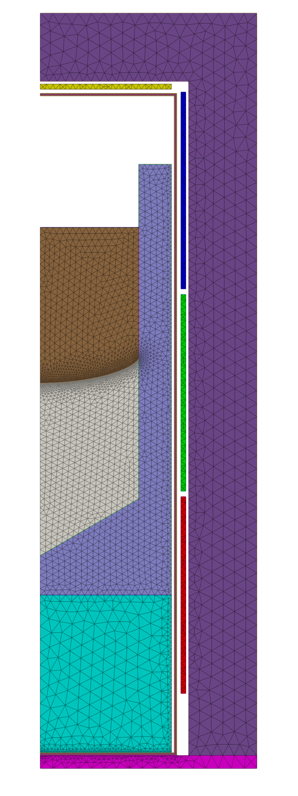
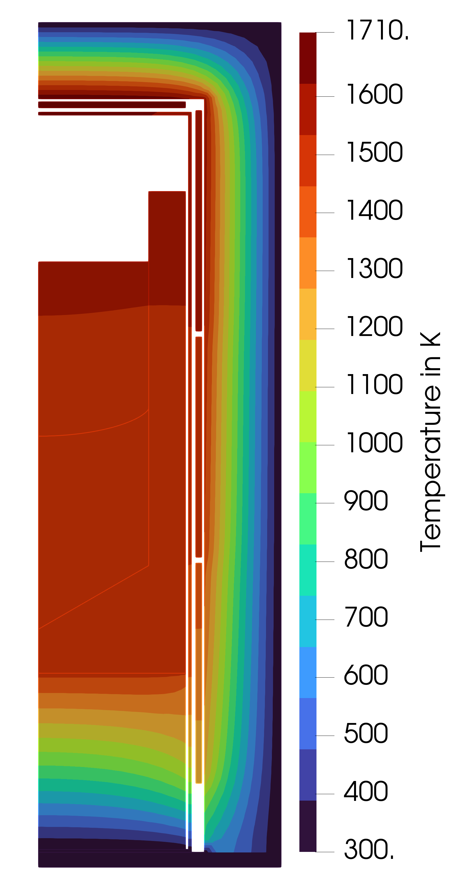

# Vertical gradient freeze

Steady-state 2D axisymmetric thermal simulation of a hypothetical vertical gradient freeze furnace.

The project is developed and maintained by the [**Model experiments group**](https://www.ikz-berlin.de/en/research/materials-science/section-fundamental-description#c486) at the Leibniz Institute for Crystal Growth (IKZ).

### Referencing
If you use this code in your research, please cite our article (available with open access):

> A. Enders-Seidlitz, J. Pal, and K. Dadzis, Development and validation of a thermal simulation for the Czochralski crystal growth process using model experiments *Journal of Crystal Growth*,  593 (2022) 126750. [https://doi.org/10.1016/j.jcrysgro.2022.126750](https://doi.org/10.1016/j.jcrysgro.2022.126750).

## Prerequisites

The simulation can be executed either in our opencgs docker container or in a custom python environment.

### Using Docker

An installation of docker is required. This project was tested with opencgs v0.3.8.

To run the docker container on Windows execute the following command in the directory containing this repository:

```
docker run -it --rm -v ${PWD}:/home/workdir nemocrys/opencgs:v0.3.8 bash
```

On Linux use:

```
docker run -it --rm -v $PWD:/home/workdir -e LOCAL_UID=$(id -u $USER) -e LOCAL_GID=$(id -g $USER) nemocrys/opencgs:v0.3.8 bash
```

This will open a docker container in interactive mode and map your working directory into the container. All required software to execute the simulation is provided in the container. Visualization is not possible.

### Own Python installation

The following setup is recommended:

- Python 3.8 or later
- Python packages (this list may be incomplete)
  - gmsh 4.11.1
  - pyelmer 1.1.5
  - objectgmsh 0.11
  - opencgs 0.3.8
  - numpy
  - pandas
  - matplotlib
- Installation of Elmer with ElmerSolver, ElmerGrid, ViewFactors executable available on system path

## Geometry

The geometry parameters are defined in [config_geo.yml](config_geo.yml) and is generated using gmsh (trough objectgmsh interface) in [geometry.py](geometry.py).



Main dimensions:

- Crucible inner diameter: 150 mm
- Crucible inner height: 298 mm
- Crucible outer diameter: 200 mm
- Crucible outer height: 328 mm
- Insulation outer diameter: 330 mm
- Insulation outer height: 565 mm

## Simulation

The main features of the model are

- Heat transfer trough conduction and radiation
- Heater power scaling: the position of the outermost point of the solidification front is fixed, the power of the heaters is scaled so that the melting point temperature is obtained there
- Phase change: the interface between crystal and melt is shifted into the isothermal of the melting point

Melt flow is not considered in the present setup.

The simulation may be setup in different ways:

- In native Elmer code, the so-called sif-file
- Using pyelmer, a python interface that helps to write the sif file
- Using opencgs, a python interface intended for crystal growth simulation that bases on pyelmer and provides several additional features

### sif-file

The simulation can be executed directly using [case.sif](case.sif), the native Elmer input file. The following steps are required

1. Run ElmerGrid `ElmerGrid 14 2 ./case.msh` to convert the mesh file to the Elmer mesh format
2. Run ElmerSolver `ElmerSolver ./case.sif`

### pyelmer

pyelmer provides an integrated workflow to setup the sif file and execute the simulation in Python. The required solvers are defined in [config_elmer.yml](config_elmer.yml), the material properties (all in SI units) in [config_mat.yml](config_mat.yml). Specific parameters for this simulation, e.g. heater powers, are defined in [config_sim.yml](config_sim.yml).

Run [simulation_setup_pyelmer.py](simulation_setup_pyelmer.py) to create the mesh (using geometry.py), the sif-file with pyelmer, run ElmerGrid and ElmerSolver.

### opencgs

opencgs was established for simulation of Czochralski growth and provides various features that simplify simulation setup and help to perform simulation studies.

#### Setup

The setup is based on a class that is intended for simulation of Czochralski growth. Nevertheless, most of the features are still available and some complexity of pyelmer is reduced. Instead of the solvers from [config_elmer.yml](config_elmer.yml), solvers defined in opencgs are used.

Material parameters are taken from [config_mat.yml](config_mat.yml); specific parameters for this simulation, e.g. heater powers, are defined in [config_sim.yml](config_sim.yml).

Run [simulation_setup_opencgs.py](simulation_setup_opencgs.py) to create the mesh (using geometry.py), the sif-file with opencgs, run ElmerGrid and ElmerSolver.

#### Execution

To make use of the infrastructure for simulation execution in opencgs use [run_opencgs_simulation.py](run_opencgs_simulation.py). It automatically creates a new directory for each simulation and documents the simulation setup and environment. The simulation setup may be updated without changing the original input files (to avoid unintentional changes) and parameter studies can be performed automatically. The settings for the opencgs simulation are defined in [config_opencgs.yml](config_opencgs.yml).

Heat flux computation hasn't been implemented here yet, the corresponding warnings/errors can be safely ignored.

## Visualization

ParaView is recommended for visualization. The `case.pvd` file needs to be loaded.
Alternatively, pyvista may be used.

## Results

A simulation was performed for a crystal height of 150 mm using 1.6 kW total heating power with the following distribution:

- top heater: 500 W
- top side heater: 500 W
- middle side heater: 300 W
- bottom side heater: 300 W

Simulation takes approx 100s on one CPU (Intel i7-9850H). A concave interface shape is obtained. The resulting temperature distribution is shown here:



Heater power was scaled in the simulation by 1.72, so the actual power distribution is

- top heater: 860 W
- top side heater: 860 W
- middle side heater: 516 W
- bottom side heater: 516 W

## Acknowledgements

[This project](https://nemocrys.github.io/) has received funding from the European Research Council (ERC) under the European Union's Horizon 2020 research and innovation programme (grant agreement No 851768).


